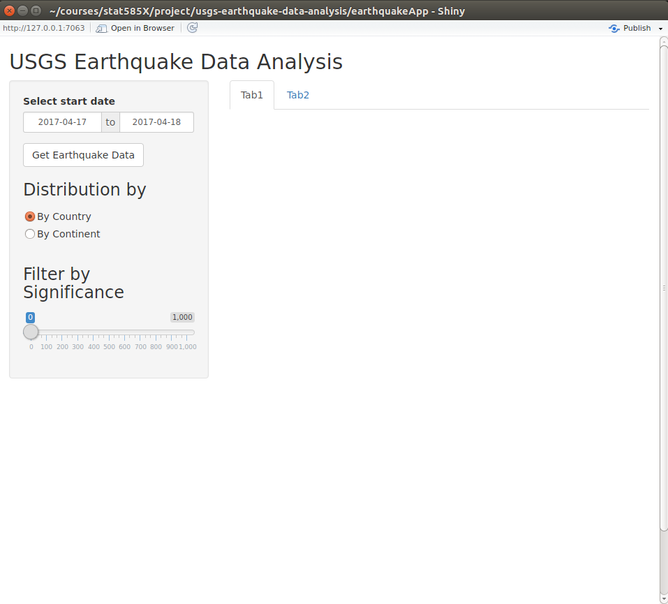
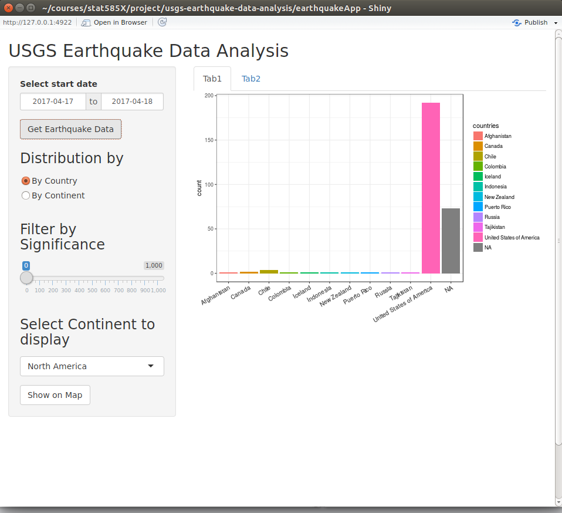
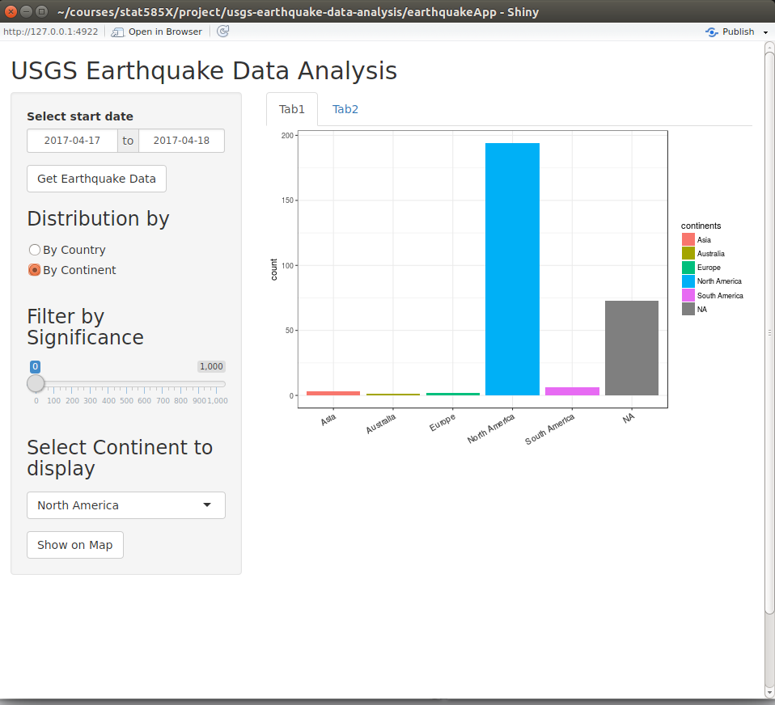
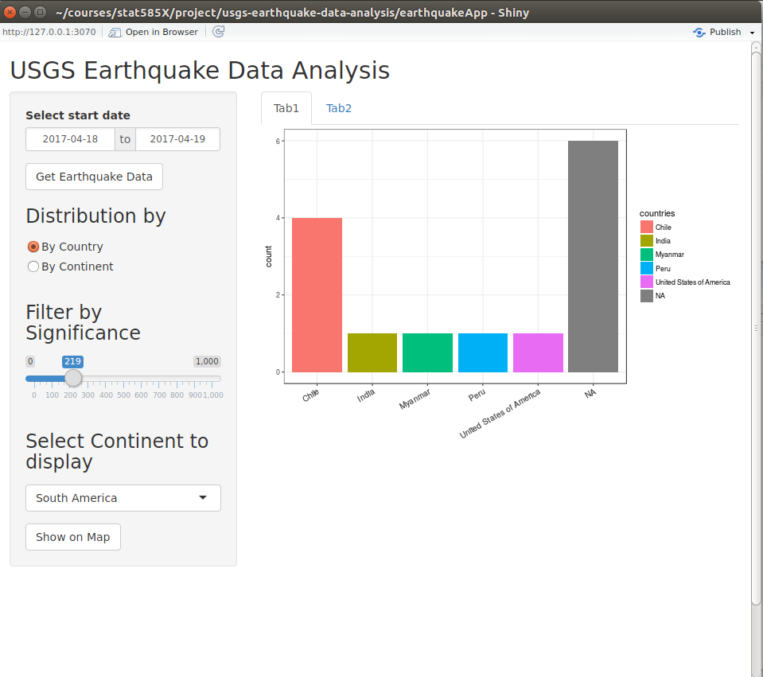
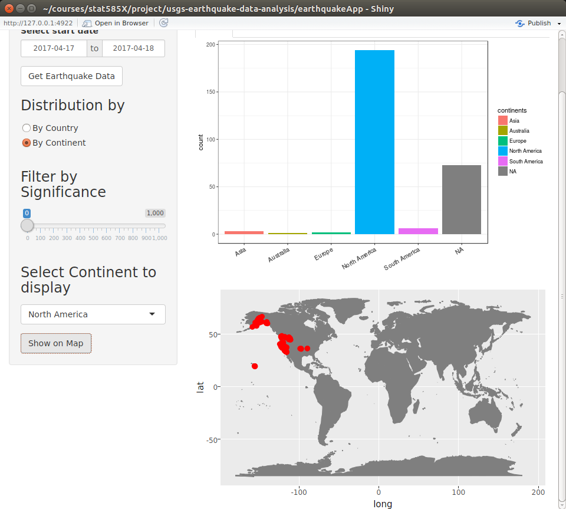
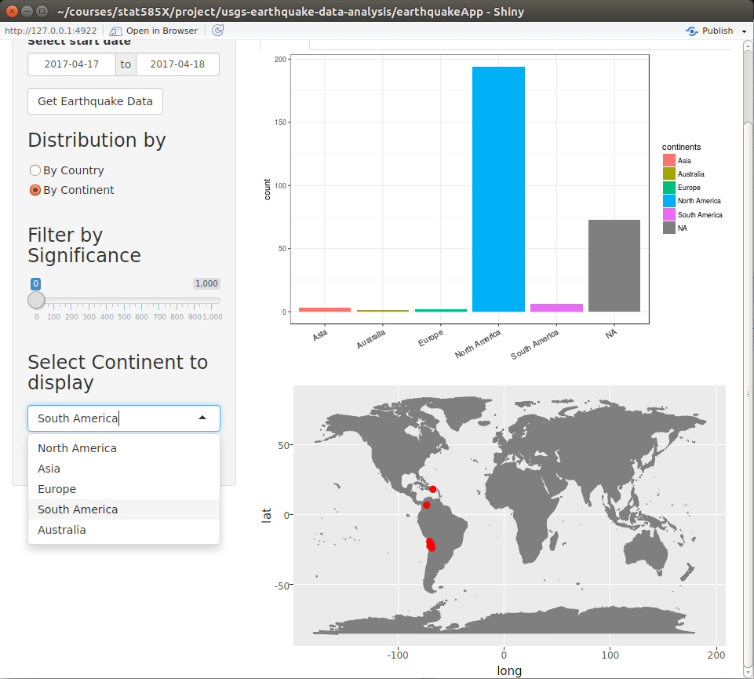
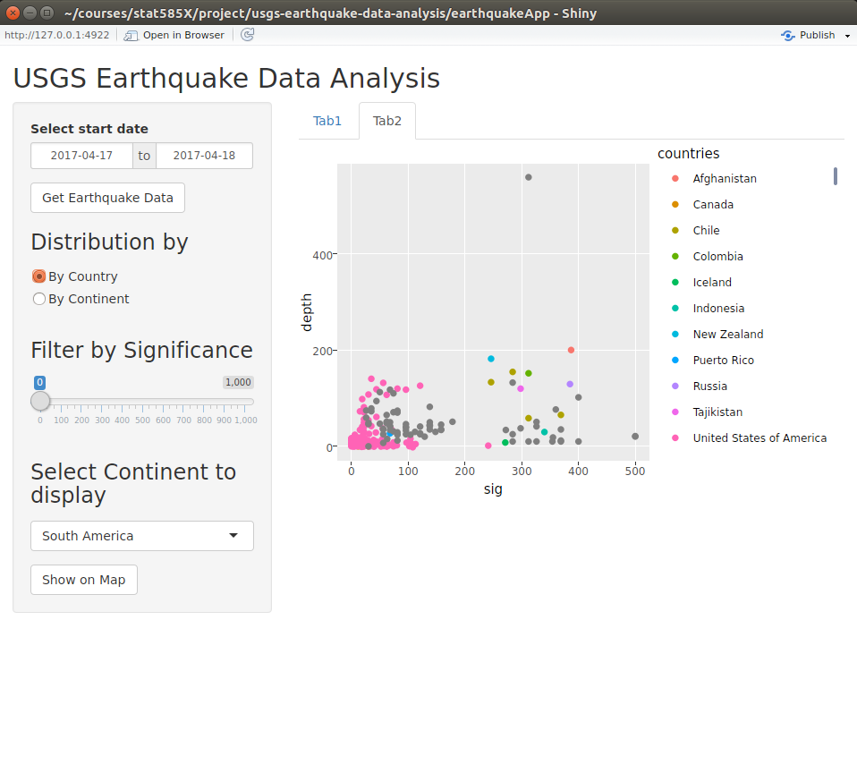
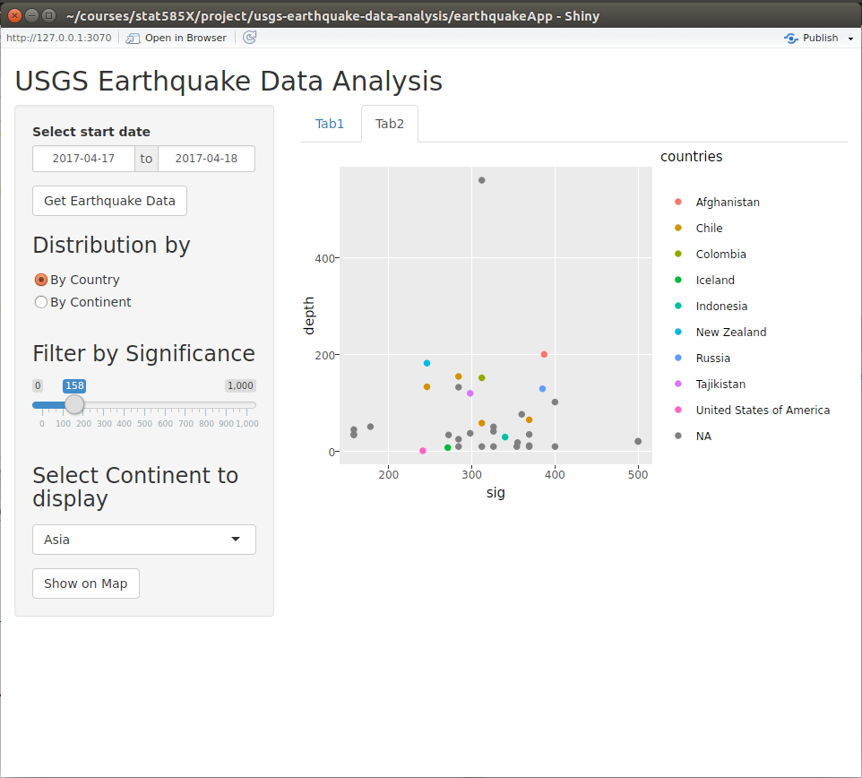

```{r setup, include=FALSE}
knitr::opts_chunk$set(echo = TRUE)
```

This project will consist of R functions and a R shiny app that will download earthquake data from the *United States Geological Survey* database between the specified dates, process the data to output a cleaned dataframe and display the data.


#### App start
Initially, a `dateRange` selector widget is displayed with a `Get Earthquake Data` button widget which lets the user select the dates between which the earthquake data is supposed to be downloaded from the USGS database. The data download starts when the user clicks the `Get Earthquake Data` button and the selected start and end dates are passed to the processing functions.




#### Sever-side Data Processing
The earthquake data is downloaded by the `get_table_from_json()` function on the server-side which takes start and end dates returned by the `dateRange` selector widget and returns a dataframe of earthquakes reported within those dates. The returned dataframe contains multiple columns that describe various features of the earthquakes including features like the *id* given by USGS, longitude, latitude, depth etc. The entire list of features along with their description can be found [here](https://earthquake.usgs.gov/data/comcat/data-eventterms.php#sig)


Another characteristic task of server-side data processing is inferring country and continent names for all the earthquakes from the given coordinates. This is performed using `attach_regions()` function which attaches two new columns, the country and the continent name where the earthquakes were reported, to the processed dataframe returned from the previous task. The `attach_regions()` function in-turn calls the `convert_coords_to_regions()`, which uses the functions from the `sp` and `rworldmap` packages, to return the *country* an *continent* names of the longitude and latitude values passed to it.

***

#### Data Display Options 
The processed data is automatically displayed in form of histogram showing the country-wise distribution of earthquakes. This histogram can be easily changed to show the continent-wise distribution using the `Distribution by` radio button widget placed below the `Get Earthquake Data` button.

***



***



***

The earthquakes can also be filtered on the significance values to only show signficant earthquakes. All earthquakes are assigned signficance values to describe how important the earthquake was. Large values indicate that the earthquake was signficant. These values are based different factors like magnitude, maximum MMI, felt reports, and estimated impact. The filtering can be performed using the `Filter by significance` widget. The effect of using the  `Filter` slider widget is automatically reflected in the country and continent-wise histograms.

***



***

The exact location of the earthquakes can also be viewed on an interactive world map. We can to select one of the 7 continents to view earthquakes that happened in and around those continents. One of the 7 continents can be selected using the `Select Continent to display` widget below the `Filter` slider widget. After selecting the continent, the `Show on Map` button widget will show all the earthquakes related to the selected continent. The effect of the significance filter `Filter` slider widget can be reflected on the map after clicking `Show on Map` button again.

***



***



***

The second tab displays an interactive scattorplot between the signficance values of the earthquakes and the depth at which the earthquakes were measured. This plot can be used to view the relationship between the two variables

***



***

The effect of `Filter` slider widget can also be reflected in the scatterplot

***



***